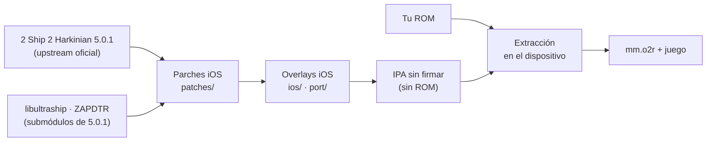

# MaskPad · fork de mtbolanos

<p align="center">
  <strong>Majora's Mask vía 2 Ship 2 Harkinian 5.0.1, nativo en iPhone y iPad.</strong><br>
  Fork de <a href="https://github.com/chrissotraidis/maskpad">MaskPad</a> de chrissotraidis,
  actualizado a la última versión de upstream y con ProMotion de verdad.
</p>

<p align="center">
  <a href="https://github.com/Mtbolanos/maskpad/actions/workflows/ios-build.yml"></a>
  
  
  
  
</p>


## Por qué existe este fork

MaskPad es un trabajo excelente de [chrissotraidis](https://github.com/chrissotraidis):
lleva [2 Ship 2 Harkinian](https://github.com/HarbourMasters/2ship2harkinian) a iOS
con render en Metal y controles táctiles personalizables. Hice este fork porque quería:

- **Jugar la última versión de 2 Ship 2 Harkinian.** El original estaba en
  4.0.2 "Keiichi Charlie".
- **Que ProMotion funcione bien.** Subir los FPS sobre 60 provocaba caídas bajo
  20 FPS en iPhone.
- **Aprovechar la resolución real de la pantalla.** El juego y los menús se
  dibujaban a un tercio de la resolución del panel.
- **Menús más cómodos en pantalla táctil.**

Tiene un hermano: [HarkinianPad](https://github.com/Mtbolanos/harkinianpad)
(Ocarina of Time), con el que comparte la libultraship para iOS.

## Qué cambia respecto del original

| | MaskPad 0.2.1 (original) | Este fork 0.3.0 |
|---|---|---|
| Upstream | 2 Ship 2 Harkinian 4.0.2 "Keiichi Charlie" | **2 Ship 2 Harkinian 5.0.1 "Battler Bravo"** |
| FPS / ProMotion | Interpolaba a 120 pero iOS presentaba a 60 | Interpola a la tasa real de la pantalla: 120 Hz con ProMotion, 60 Hz en modo de bajo consumo |
| Resolución | Juego y menús a 1/3 del panel | Menús siempre nítidos. Opción **Native Screen Resolution** para el juego |
| Tope de FPS | — | **Lock at 60 FPS**, opcional, para jugar a resolución nativa con 60 estables |
| Menús táctiles | Sin scroll con el dedo. La barra de categorías tapaba los textos | Scroll con un dedo e inercia, sin mover sliders por accidente. Tooltips con el dedo quieto. Categorías sin barra encima |
| Aviso de caída de FPS | Saltaba en falso con Match Refresh Rate | Compara con el objetivo real de FPS |
| Metal | — | Caché de estados de depth-stencil |
| Bundle ID | `com.chrissotraidis.maskpad` | `cl.mtbolanoss.maskpad` |

### Opciones nuevas en el menú

En **Settings → Graphics**:

- **Native Screen Resolution** (apagada por defecto). Dibuja el juego a la
  resolución física de la pantalla. Se ve mucho más nítido, pero exige bastante
  más a la GPU, la batería y la temperatura.
- **Lock at 60 FPS**, justo debajo. Solo actúa con la resolución nativa
  encendida: fija la interpolación en 60 y bloquea el slider de FPS, que
  conserva tu valor. Si apagas la resolución nativa, la opción queda en pausa con
  su marca y vuelve a aplicarse al encenderla.

### Scroll táctil en los menús

- Arrastrar hace scroll, con inercia, y nunca presiona botones ni mueve sliders.
- Solo un arrastre claramente horizontal mueve un slider.
- Con el dedo quieto se muestra el tooltip sin presionar nada. Un toque se
  aplica al soltar.
- Las barras de scroll laterales se agarran y arrastran como en un navegador.
- Los controles táctiles del juego no pasan por este filtro.

## Cómo compilarlo

Este repositorio no publica apps compiladas. Cada quien
compila la suya desde el código de 2 Ship 2 Harkinian (ver
[derechos y licencias](#derechos-y-licencias)).

Necesitas un Mac con Apple Silicon y Xcode, además de las dependencias de
compilación:

```sh
brew install cmake ninja pkgconf sdl2 glew nlohmann-json libpng libzip \
  tinyxml2 libogg libvorbis opus opusfile sdl2_net

git clone https://github.com/Mtbolanos/maskpad.git
cd maskpad

scripts/clone-sources.sh
scripts/apply-patches.sh
scripts/configure-ios.sh --device
scripts/build-ios.sh --device
scripts/package-unsigned-ipa.sh
```

El resultado es `artifacts/MaskPad-0.3.0-unsigned.ipa`. Fírmalo con tu
herramienta de sideloading de siempre. Cada push también compila en GitHub
Actions. Para el simulador, la firma con tu propio equipo de desarrollo y el
detalle completo, ver [`docs/building.md`](docs/building.md) (en inglés).

> [!NOTE]
> **¿Vienes del MaskPad original?** Este fork usa otro bundle ID, así que se
> instala como una app aparte. Para llevarte tus partidas, copia `Save/` y tus
> mods desde la carpeta del original. **No copies `mm.o2r`** (se regenera desde
> tu ROM). Es mejor no copiar la configuración antigua, porque viene de 4.0.2.

## Primer arranque

1. Abre la app una vez para que iOS cree su carpeta.
2. En **Archivos → En mi iPhone → MaskPad**, copia tu ROM de Majora's Mask
   (`.z64`, `.n64` o `.v64`).
3. Vuelve a la app y toca **Rescan**. Déjala abierta mientras genera `mm.o2r`.
4. A jugar.

La ROM y el archivo generado nunca salen de la app.

## Controles

Los controles táctiles son los del original: stick, D-pad, A/B/Z, botones C
alineados con el HUD del juego, L/R y Start, con un editor para mover, cambiar de
tamaño u ocultar cada uno, y opacidad ajustable. Desde **Settings → Controls**
puedes ocultarlos cuando usas un control físico. También hay soporte para
teclado, mouse/trackpad y controles compatibles con SDL2. Para apuntar con el
giroscopio de un control, activa su sensor en **Settings → Controls → Gyro** y
luego **Enhancements → Camera → First Person → Gyro Aiming**.

## Cómo está armado



| Ruta | Para qué sirve |
|---|---|
| [`patches/2ship-ios.patch`](patches/) | Integración iOS sobre 2 Ship 2 Harkinian |
| [`patches/libultraship-ios.patch`](patches/) | libultraship para iOS, compartida con [HarkinianPad](https://github.com/Mtbolanos/harkinianpad) |
| [`patches/zapdtr-ios.patch`](patches/) | Extractor de assets para iOS |
| [`ios/`](ios/), [`port/`](port/) | Código iOS (controles táctiles, ciclo de vida) y CMake |
| [`scripts/`](scripts/) | Clonar, parchar, compilar y empaquetar |

## Créditos

- **[chrissotraidis](https://github.com/chrissotraidis)**, autor de MaskPad: la
  integración iOS, los controles táctiles y todo lo que hace posible este fork.
- **[Harbour Masters](https://github.com/HarbourMasters)**, por 2 Ship 2
  Harkinian, libultraship, ZAPDTR y OTRExporter.
- El proyecto de decompilación de Majora's Mask, SDL y sus contribuidores.

<a id="derechos-y-licencias"></a>
## Derechos y licencias

Proyecto comunitario no oficial, sin relación con Nintendo ni con Harbour Masters.
No incluye el juego, ROMs ni datos derivados de una ROM: necesitas tu propia
copia legal.

El código propio de MaskPad pertenece a chrissotraidis y no tiene una licencia
libre. Lee [`RIGHTS_AND_LICENSES.md`](RIGHTS_AND_LICENSES.md) (en inglés) antes de
copiar o distribuir. Cada componente de terceros conserva su propia licencia.
